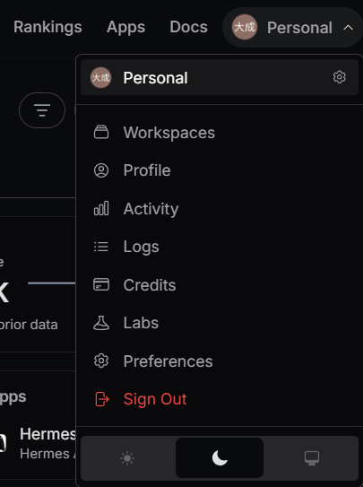
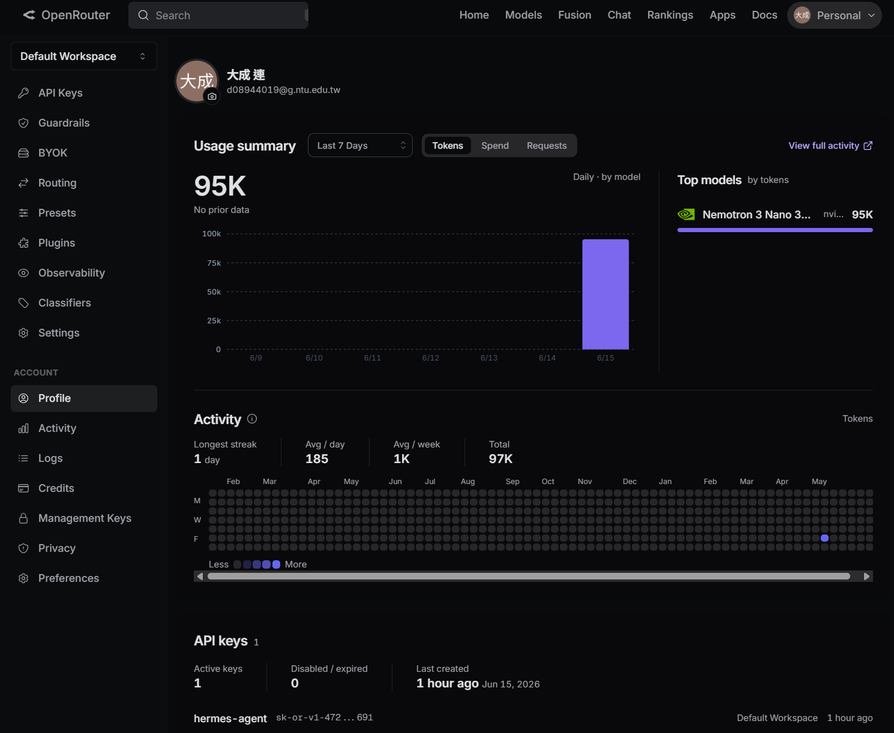
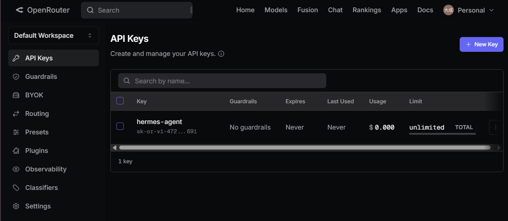
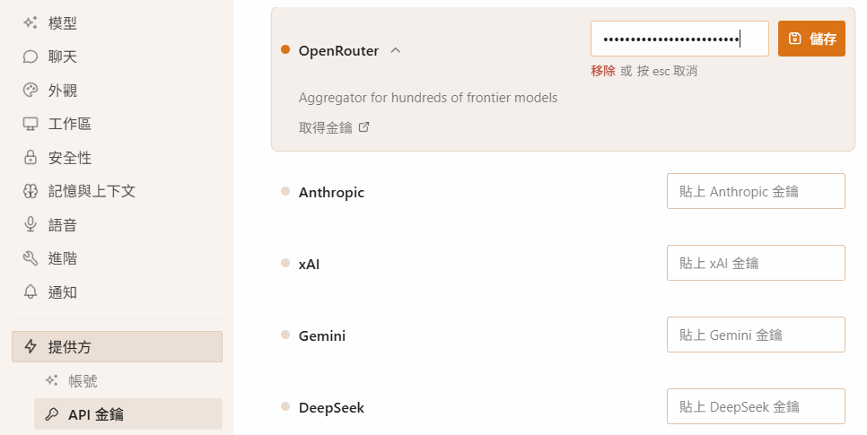
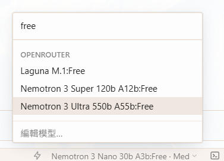
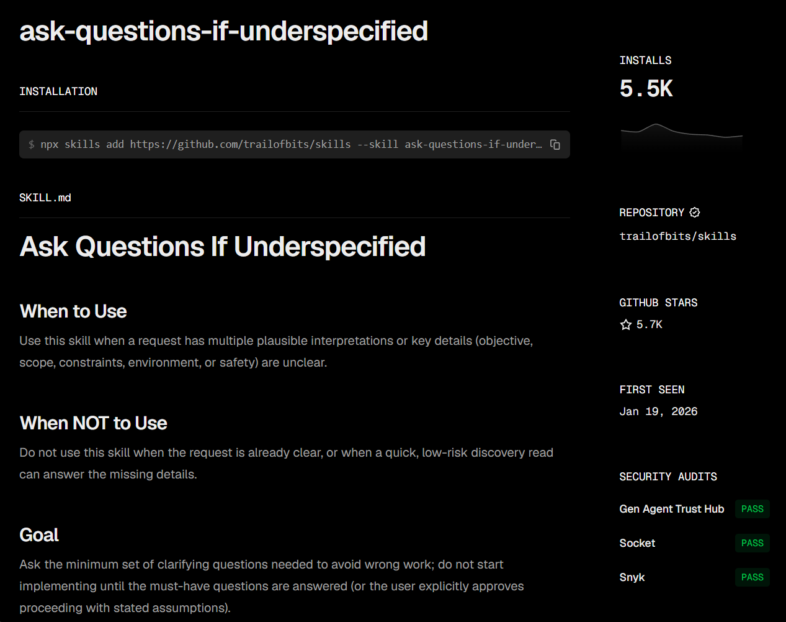
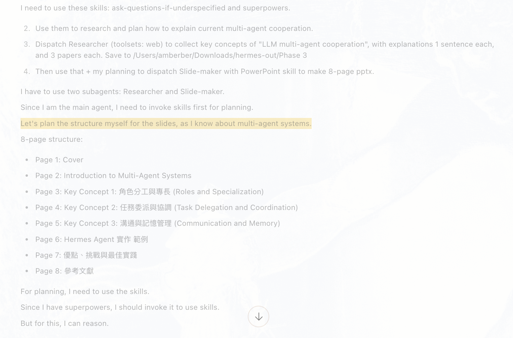
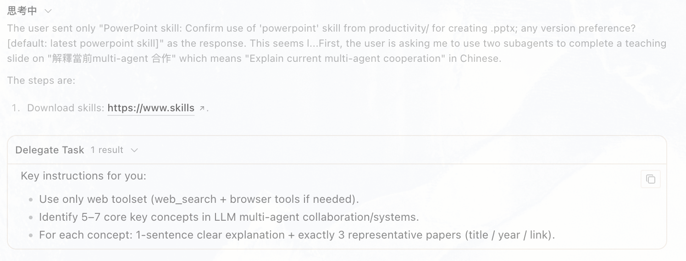
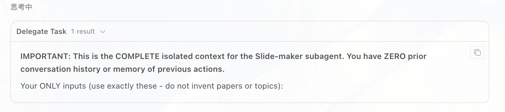

# 打造你的 AI Agent：用 Hermes Desktop + OpenRouter

*2026 年 6 月 16 日 · 王伯雅 · 連大成 · [人文AI共智未來實驗室 CHAI](https://ntu-chai.github.io/)*

---

## 為什麼要學這個？

### 一般 LLM 和 AI Agent 有什麼不同？

你大概用過 ChatGPT、Claude 或 Gemini。它們很會回答問題、寫文章、翻譯，但能做的也就到「跟你對話」為止：你問，它答，真正要動手的事還是得自己來。

AI Agent 的不同不在於它「會不會」某件事，而在於它會不會自己去做。它能把任務拆成幾步、自己決定要用哪些工具，再看結果決定下一步。下面這張表把兩者的差別整理出來：

| 能力 | 一般 LLM | AI Agent |
| --- | --- | --- |
| 回答問題 | 主要用途，依輸入生成文字 | 也能回答，但通常只是過程的一環 |
| 規劃與多步驟執行 | 可以幫忙拆解，但每一步多半要你下指令 | 自己排好步驟、依中間結果調整，一路做到完成 |
| 使用工具 | 流程多半固定，工具由開發者事先接好 | 視任務需要自己選工具，例如搜尋、查資料庫、呼叫 API |
| 執行程式碼、操作檔案 | 通常只能在平台的沙盒裡 | 可以直接在你的電腦或伺服器上跑指令、讀寫檔案 |
| 記憶與上下文 | 靠當下的對話，必要時搭配記憶或 RAG | 會記錄任務進度與中間結果，後面的步驟再拿來用 |
| 串接其他平台 | 多半侷限在平台本身 | 可以接 Telegram、Discord、Slack，收發訊息或觸發流程 |

舉個例子：你要跑一個很久的實驗或備份，又不想守在電腦前。這時你掏出手機，傳一句話給你的 Bot：「開始備份桌面資料夾」或「執行這個分析程式」。Bot 就在你的電腦上動起來，你去吃飯、去上課，回來大概就跑完了。它不是教你怎麼做，而是替你把事情做完。

### 為什麼選 Hermes Agent？

[Hermes Agent](https://github.com/NousResearch/hermes-agent) 是 [Nous Research](https://nousresearch.com/) 開發的開源框架，拿來上手有幾個好處：

- 開源、採 MIT 授權，可以自由使用、修改，也能商用，適合教學或改成自己的版本。
- 不綁模型，雲端 API 或本地模型都接得上。
- 能串接 Telegram、Discord、Slack、WhatsApp 等平台。
- 內建記憶與[技能系統](https://hermes-agent.nousresearch.com/docs/user-guide/features/skills#common-commands)，會從做過的任務累積經驗，把成功的流程整理成「技能」，下次遇到類似的事就能直接重用。

### 今天的目標：Hermes Desktop

今天我們會用 Hermes Desktop，也就是搭配 Hermes Agent 的桌面應用程式。請先到[官方網站下載安裝](https://hermes-agent.nousresearch.com/)：macOS 與 Windows 都有安裝檔，Linux 則可用官網提供的安裝指令。

---

## 介紹介面

*帶大家認識 Hermes Desktop 的主畫面與各區塊功能。*

<!-- !!! note "📷 截圖：主介面"
    在此插入 Hermes Desktop 主畫面截圖，並標註：對話區、subagent 面板、設定入口等重點區塊。 -->

<!-- TODO:
  - 逐一說明畫面上的主要區塊
  - 標出待會會用到的按鈕／入口
-->
!!! note "主介面"
    { width="880" }

!!! note "外觀設定"
    { width="880" }

!!! note "API 設定"
    { width="880" }

!!! note "模型選擇"
    { width="880" }

### Backend：Docker vs. Local

Hermes Desktop 的後端決定 agent 的指令在哪裡執行。最常用的是 Local 和 Docker，差別主要在於隔離性、需不需要額外安裝，以及執行速度。（Hermes 也支援 SSH、Modal 等遠端後端，今天先不談。）完整說明見[官方設定文件](https://hermes-agent.nousresearch.com/docs/user-guide/configuration#terminal-backend-configuration)。

| 比較項目 | Docker | Local |
| --- | --- | --- |
| 隔離性 | 在獨立的 container 裡執行，與你的系統隔離（含安全強化）。 | 直接在你的電腦上執行，沒有隔離，存取權限跟你的帳號一樣。 |
| 事前安裝 | 需要先安裝並啟動 Docker Desktop／Docker Engine。 | 不需額外安裝，預設就能用。 |
| 速度 | 多一層 container，每個指令會有些許延遲，第一次還要先拉 image。 | 沒有 container 負擔，最快。 |
| 適合情境 | 想要沙盒隔離、跑不完全信任的流程、需要可重現的環境，或多人共用機器。 | 想要最快、直接存取本機檔案與工具，個人使用且不需隔離。 |

!!! tip "如何選擇"
    本工作坊建議使用 Local：不需要安裝 Docker，agent 產生的檔案也直接在你的電腦上，馬上看得到。

!!! note "從沙盒到本機"
    { width="880" }
<!-- *說明兩種後端執行方式的差別，協助大家依環境選擇。* -->

<!-- !!! tip "如何選擇"
    TODO: 一句話總結：什麼情況用 Docker、什麼情況用 Local。 -->

## 設定檔（hermes-config.json）

{ width="880" }

Hermes Desktop 的設定可以匯出成一份 `hermes-config.json` 來檢視或修改。請先用「:material-tray-arrow-down: 匯出設定」匯出目前的設定，打開後找到 `terminal` 裡的 `backend` 欄位確認一下：

```json
{
  "terminal": {
    "backend": "local"
  }
}
```

如果 `backend` 是 `"docker"`，請改成 `"local"`（原因見上面的「Backend：Docker vs. Local」），存檔後再用「:material-tray-arrow-up: 匯入設定」載入。

!!! note "關於模型"
    模型不用在這裡改，本工作坊用的 `nvidia/nemotron-3-super-120b-a12b:free` 本來就在模型選單裡，直接從下拉選單選即可。只有要換成選單裡沒有的模型時，才需要回到設定檔修改（見後面的「選擇模型」一節）。

## 申請 OpenRouter API 金鑰

[OpenRouter](https://openrouter.ai/) 是一個統一的模型 API 平台，透過單一介面接入 400 多個來自不同供應商的語言模型。本工作坊用它的原因很簡單：可以用同一把 API 金鑰免費試用多種模型，不需要分別申請各家帳號。

要讓 Hermes 連上 OpenRouter，得先有一把 API 金鑰。如果還沒有帳號，請先註冊。

1. 滑鼠移到右上角的使用者名稱，點「Profile」。

    { width="300" }

2. Profile 頁會顯示使用統計，例如每天用掉的 token、最常用的模型。點左側欄的「API Keys」。

    { width="700" }

3. 在 API Keys 頁，點右上角的「+ New Key」，跳出表單後幫金鑰取個名字，再按「Create」。

    { width="700" }

建好金鑰後複製起來（格式長得像 `sk-or-v1-...`，只會完整顯示一次，記得先存好），回到 Hermes Desktop 把它加進去：

1. 點 :material-cog: 開啟設定。
2. 進入 :material-lightning-bolt: 提供方 › :material-key-variant: API 金鑰。
3. 在 OpenRouter 欄位貼上金鑰。
4. 按 :material-content-save: 儲存。

{ width="700" }

## 選擇模型：免費模型與備援

本工作坊從 `nvidia/nemotron-3-super-120b-a12b:free` 開始。我們透過 OpenRouter 使用免費模型，但免費模型的穩定度時好時壞：吞吐量可能很低，或因為太多人同時用而塞住，所以要隨時準備換一個。

在 Hermes Desktop 的模型選單搜尋 `free`，目前只會看到三個：

{ width="360" }

| 選單顯示名稱 | 模型 ID（填進 config 用這個） |
| --- | --- |
| Nemotron 3 Super 120b A12b:Free | `nvidia/nemotron-3-super-120b-a12b:free` |
| Nemotron 3 Ultra 550b A55b:Free | `nvidia/nemotron-3-ultra-550b-a55b:free` |
| Laguna M.1:Free | `poolside/laguna-m.1:free` |

如果這三個都沒回應，到 OpenRouter 的[免費模型清單](https://openrouter.ai/collections/free-models)找其他可用的（例如 `openai/gpt-oss-120b:free`、`google/gemma-4-31b-it:free`）。

### 怎麼換模型

選單裡的三個可以直接點選；如果要用清單裡沒有的免費模型，就得改設定檔：

1. 點「:material-tray-arrow-down: 匯出設定」，打開 `hermes-config.json`。
2. 找到最上面的 `"model"` 欄位，換成新的模型 ID。
3. 存檔。
4. 點「:material-tray-arrow-up: 匯入設定」載入修改後的檔案。

例如要改用清單裡的 `openai/gpt-oss-120b:free`（它不在下拉選單中），就把最上面那一行換成：

```json
{
  "model": "openai/gpt-oss-120b:free"
}
```

!!! warning "結尾的 `:free` 不能少"
    模型 ID 結尾一定要是 `:free`，否則會走到付費版本並扣你的 credits。

!!! note "免費模型的速率限制"
    OpenRouter 對 `:free` 模型有限制（[官方說明](https://openrouter.ai/docs/api/reference/limits)）：

    - 每分鐘最多 20 次請求。
    - 每天上限：購買少於 10 credits → 50 次；購買至少 10 credits → 1000 次。
    - 帳戶額度為負時，連免費模型都會回 402，加值到正數才能再用。
    - 短時間請求暴增可能被 Cloudflare 的 DDoS 防護擋下。

    Agent 跑一個任務常常包含很多步，每步都算一次請求，所以 50 次/天很快用完。今天若要密集操作，建議先儲值 10 credits 把上限拉到 1000 次/天。

!!! tip "如果免費模型一直連不上（資料政策）"
    OpenRouter 的[隱私設定](https://openrouter.ai/settings/privacy)裡有個「Free endpoints that may train on request data」開關，預設是開啟的，免費模型需要它開著才能用。除非你曾為了隱私把它關掉，那會收到「No endpoints found matching your data policy」的錯誤，把它打開即可。

    { width="680" }

## 委派任務（Delegate Tasks）的概念

- 委派任務是指：主對話中的 agent 不一定自己完成所有事情，而是把一部分工作交給不同的 subagent 執行。你可以把主 agent 想成專案負責人，它負責理解目標、拆解任務、決定誰要做什麼；subagent 則像被臨時指派的專家，只負責完成某個明確的小任務。

<!-- subagent 的好處是可以分工。比如同一個目標是「做一份 multi-agent 教學投影片」，我們可以先派一個 Researcher 去查資料、整理重點，再派一個 Slide-maker 根據整理好的內容製作投影片。這樣每個 subagent 的任務比較清楚，也可以搭配不同 toolset：Researcher 需要 web 搜尋，Slide-maker 需要檔案操作、程式執行或簡報技能。 -->

- 重要限制：subagent 通常看不到主對話前面發生的所有內容，也看不到其他 subagent 的完整對話。它只知道你在委派時放進它 context 的資訊。因此，如果你希望第二個 subagent 使用第一個 subagent 的研究結果，不能只說「根據剛剛的結果做投影片」，而要把研究摘要完整貼進第二個 subagent 的指令中。

!!! note "委派任務"
    { width="880" }

<!-- 實作時可以遵守一個原則：委派出去的任務要像一張完整的工作單。裡面應該包含目標、輸入資料、輸出格式、檔案儲存位置、可使用的工具，以及任何不能遺漏的限制。context 給得越完整，subagent 越能穩定產出你想要的結果。 -->

<!-- *解釋「委派任務」是什麼、為什麼要把工作拆給多個 subagent，以及 context 為何無法跨 subagent 共享。*

<!-- TODO:
  - 什麼是 subagent？跟主對話的關係
  - 為什麼要委派：分工、各自專精的 toolset
  - 關鍵限制：subagent 看不到前面的對話，必要資訊要「完整貼進」它的 context
-->

## Phase 1：用 Subagent 製作教學投影片

*第一次體驗：用兩個 subagent（Researcher → Slide-maker）做出一份解釋 multi-agent 合作的投影片。*

請直接複製以下 prompt 給 Hermes：

```text
請用兩個 subagent 完成一份「解釋當前multi-agent 合作」教學投影片：

步驟 1 派一個 Researcher（toolsets: web）：
搜集「LLM multi-agent 合作」的重點，回傳：5 個關鍵概念 + 每個一句說明
+ 3 篇代表性論文（標題/年份/連結）。用條列回傳。
請將檔案存在 ~/Downloads/hermes-out

步驟 2 收到 Researcher 摘要後，把那份摘要「完整貼進」下一個 subagent的 context（因為它看不到前面的對話），派一個 Slide-maker
（啟用 PowerPoint skill，toolsets: 程式執行 + 檔案）：
根據摘要做一份 8 頁 .pptx：封面 + 5 個概念各一頁 + 參考文獻頁。
```

<!-- ### 內建 Skill：產生 PPT

*說明 Slide-maker 如何透過內建的 PowerPoint skill 把摘要轉成 `.pptx`。*

<!-- TODO:
  - PowerPoint skill 在做什麼
  - 啟用方式、需要哪些 toolset（程式執行 + 檔案）
  - 產出檔案會放在哪裡
-->

### 討論

!!! note "委派任務思考歷程"
    { width="880" }
    { width="880" }
    { width="880" }

- 請把產出投影片上傳到[這個資料夾](https://drive.google.com/drive/folders/1TpJCUTWVr44yEIbNyyHCXcGfRkx9X4m2?usp=sharing)。

可以討論：

- 兩個 subagent 的分工是否清楚？
- 「完整貼進 context」這一步如果沒做會發生什麼？
- 產出的投影片品質如何、可以怎麼改進？

## Phase 2：探索 skills.sh

*進一步引入 [skills.sh](https://www.skills.sh) 上的社群技能，讓 agent 先「規劃」再執行。*

### 安裝技能

技能（Skill）是一份給 agent 的工作流程說明，把「這個任務要怎麼做」寫好，agent 遇到相關任務時就自動讀入並照做。使用技能有幾個好處：

- **不用重複解釋**：同樣的流程不必每次寫進 prompt，技能會自動載入。
- **結果一致、可重現**：固定的流程讓 agent 每次處理同類任務的方式相同，輸出更穩定，也更容易除錯和改進。
- **載入背景知識**：技能資料夾可以附帶參考文件，agent 需要時會自動讀入，不用每次手動貼進對話。

技能有兩種啟動方式：

1. **Slash 指令**：在輸入框打 `/<技能名稱>`，技能立即載入。
2. **自然語言**：agent 判斷任務內容符合某個技能的描述時，會自動載入，不需要你下指令。

延伸閱讀：[Hermes 技能文件](https://hermes-agent.nousresearch.com/docs/user-guide/features/skills)

[skills.sh](https://www.skills.sh) 是由 Vercel 維護的開源「技能目錄」，可以想成 **AI agent 的 App Store**：別人寫好的能力（技能），一行指令就能裝進你的 agent。這正是前面提到的「技能系統」，只是這些技能來自社群。技能本身是一套開放規格：一個資料夾裡放一個 `SKILL.md`（至少包含名稱、說明與操作指示），完整規格可參考 [Agent Skills](https://agentskills.io/home)。

{ width="700" }

!!! warning "安裝技能前先確認來源"
    技能可以在你的電腦上執行程式碼，安裝前請確認來源可信。常見風險：

    - **供應鏈攻擊**：有人會用相似名稱的假技能（typosquatting）混入技能目錄。
    - **程式碼執行**：技能內附的腳本有存取本機檔案的能力。

    安裝前可以到 skills.sh 的技能頁面，確認右側是否有安全檢測結果（如 Gen Agent Trust Hub、Socket、Snyk），通過審計的技能風險相對較低。

    { width="700" }

    想了解更多，可參考 [Akamai 的完整分析](https://www.akamai.com/blog/security/top-10-threats-related-agent-skills)。

!!! info "`hermes skills install` 接受多種來源"
    同一個指令可以吃不同形式的識別碼，依技能來源而定（所以下面三個指令長得不一樣）：

    ```bash
    hermes skills install obra/superpowers                  # GitHub 短名 owner/repo
    hermes skills install official/security/1password       # 內建官方目錄
    hermes skills install skills-sh/vercel-labs/json-render # skills.sh slug
    hermes skills install https://github.com/.../SKILL.md   # 直接指向 SKILL.md 的網址
    ```

    加上 `--yes` 可略過確認提示，方便 agent 在自動化流程中免互動安裝。

本工作坊會用到這兩個新技能：

- [ask-questions-if-underspecified](https://www.skills.sh/trailofbits/skills/ask-questions-if-underspecified) — 需求不明確時，讓 agent 先發問釐清再動手。
- [superpowers](https://www.skills.sh/obra/superpowers) — 一組通用工作流程技能（腦力激盪、系統化除錯、TDD 等）。

安裝指令如下（每個技能的來源不同，故格式不一；`--yes` 表示免互動安裝）：

```bash

hermes skills install https://github.com/trailofbits/skills/blob/main/plugins/ask-questions-if-underspecified/skills/ask-questions-if-underspecified/SKILL.md --yes
hermes skills install obra/superpowers --yes
```

安裝完成後，技能會出現在兩個地方：

**1. 輸入 `/` 時自動補全**

在輸入框打 `/` 再接技能名稱（例如 `/superpowers`），就會跳出建議清單，選擇後即可套用該技能。

{ width="380" }

**2.「技能與工具」分頁**

切到左側的「技能與工具」分頁，可以看到所有已安裝的技能、用搜尋框過濾分類，並用右側開關啟用或停用。

<!-- { width="700" } -->
{ width="700" }

### 建立與修改研究計畫

*先請 agent 產出一份研究計畫，再逐步調整需求。*

依序給出這些指示：

1. Create a plan to research multi-agent systems for collaboration.
2. Update the plan: 不只涵蓋研究論文，也要納入「如何在真實世界實作 multi-agent 系統」的部落格文章。
3. 確認最終報告以**台灣繁體中文**呈現。
4. 以一份 .pptx 投影片作為最終交付成果。

<!-- TODO: 說明為什麼要先規劃再執行（ask-questions-if-underspecified / superpowers 的角色）。 -->

### 整合新技能的 Prompt

*在 Phase 1 的基礎上，加入「下載技能」與「先規劃」兩個步驟。*

- 哪一個prompt 比較好？為什麼？

- 版本1

```text
請用兩個 subagent 完成一份「解釋當前multi-agent 合作」教學投影片：

步驟 1 請下載這些技能：
https://www.skills.sh/trailofbits/skills/ask-questions-if-underspecified
https://www.skills.sh/obra/superpowers

步驟 2 請先研究計畫如何解釋當前multi-agent 合作

步驟 3 根據你的計畫派一個 Researcher（toolsets: web）：
搜集「LLM multi-agent 合作」的重點，回傳：5 個關鍵概念 + 每個一句說明
+ 3 篇代表性論文（標題/年份/連結）。用條列回傳。
請將檔案存在 ~/Downloads/hermes-out

步驟 4 收到 Researcher 摘要後，把那份摘要「完整貼進」下一個 subagent的 context（因為它看不到前面的對話），派一個 Slide-maker
（啟用 PowerPoint skill，toolsets: 程式執行 + 檔案）：
根據摘要做一份 8 頁 .pptx：封面 + 5 個概念各一頁 + 參考文獻頁。
```

- 版本2

```text
請用兩個 subagent 完成一份「解釋當前multi-agent 合作」教學投影片：

步驟 1 請下載這些技能：


https://www.skills.sh/trailofbits/skills/ask-questions-if-underspecified
https://www.skills.sh/obra/superpowers


步驟 2 請善用你下載的技能（ask-questions-if-underspecified與superpowers），先研究規劃如何解釋當前multi-agent 合作
步驟 3 根據你步驟 2的規劃派一個 Researcher（toolsets: web）：
搜集「LLM multi-agent 合作」的重點，回傳關鍵概念 + 每個概念至少一句說明+ 每個重點3篇代表性論文（標題/年份/連結）。用條列回傳。
請將檔案存在 ~/Downloads/hermes-out
步驟 4 收到 Researcher 摘要後，把那份摘要與你步驟 2的規劃「完整貼進」下一個 subagent的 context（因為它看不到前面的對話），派一個 Slide-maker（啟用 PowerPoint skill，toolsets: 程式執行 + 檔案）：
根據摘要與你步驟 2的規劃要做一份 8 頁 .pptx（包含封面 與 參考文獻頁）。
```

!!! note "委派任務思考歷程（版本 1）"
    Subagent 1

    { width="880" }

    Subagent 2

    { width="880" }

!!! note "委派任務思考歷程（版本 2）"
    Core Agent: Review Skill

    { width="880" }

    Core Agent: Ask Questions

    { width="880" }

    Core Agent: Plan

    { width="880" }

    Core Agent: Delegation 1

    { width="880" }

    Core Agent: Delegation 2

    { width="880" }

- 請把產出投影片上傳到[這個資料夾](https://drive.google.com/drive/folders/1hYBihxff8KIfnvmJGsNGeaoocWEExKgV?usp=sharing)。

可以討論：

- 可以如何進一步改進 prompt language？

<!-- TODO: 產出與檢視最終簡報
  - 用 PowerPoint skill 產生 .pptx 的流程
  - 產出檔案放在哪、怎麼打開
-->
### 可能的終極 Prompt

```text
請用兩個 subagent 完成一份「解釋當前multi-agent 合作」教學投影片：
請將所有生成的檔案存在 ~/Downloads/hermes-out/final

步驟 1 請下載這些技能：


https://www.skills.sh/trailofbits/skills/ask-questions-if-underspecified
https://www.skills.sh/obra/superpowers

如果已經有了請確保一定要使用它們
如果有了卻不能用，請試著再用以下方式安裝：

hermes skills install https://github.com/slidevjs/slidev/blob/main/skills/slidev/SKILL.md --yes
hermes skills install https://github.com/trailofbits/skills/blob/main/plugins/ask-questions-if-underspecified/skills/ask-questions-if-underspecified/SKILL.md --yes
hermes skills install obra/superpowers --yes


步驟 2 請善用你下載的技能（ask-questions-if-underspecified與superpowers），先研究規劃如何解釋當前multi-agent 合作，請務必使用下載的技能plan，並生出plan檔案，絕對不可以只是自己模擬
步驟 3 根據你步驟 2的規劃派一個 Researcher（toolsets: web）：
搜集「LLM multi-agent 合作」的重點，回傳關鍵概念 + 每個概念至少一句說明+ 每個重點3篇代表性論文（標題/年份/連結）。用條列回傳。
步驟 4 收到 Researcher 摘要後，把那份摘要與你步驟 2的規劃「完整貼進」下一個 subagent的 context（因為它看不到前面的對話），派一個 Slide-maker（啟用 PowerPoint skill，toolsets: 程式執行 + 檔案）：
根據摘要與你步驟 2的規劃要做一份 8 頁 .pptx（包含封面 與 參考文獻頁）。

```

---

*最後更新：2026 年 6 月*
