# 打造你的 AI Agent：用 Hermes Desktop + OpenRouter

*2026 年 6 月 16 日*

---

## 為什麼要學這個？

### 一般 LLM 和 AI Agent 有什麼不同？

你大概用過 ChatGPT、Claude 或 Gemini。它們很會回答問題、寫文章、翻譯，但能做的也就到「跟你對話」為止：你問，它答，真正要動手的事還是得自己來。

AI Agent 的不同不在於它「會不會」某件事，而在於它會不會自己去做。它能把任務拆成幾步、自己決定要用哪些工具，再看結果決定下一步。下面這張表把兩者的差別整理出來：

| 能力 | 一般 LLM | AI Agent |
| --- | --- | --- |
| 回答問題 | 主要用途，依輸入生成文字 | 也能回答，但通常只是過程的一環 |
| 規劃與多步驟執行 | 可以幫忙拆解，但每一步多半要你下指令 | 自己排好步驟、依中間結果調整，一路做到完成 |
| 使用工具 | 流程多半固定，工具由開發者事先接好 | 視任務需要自己選工具，例如搜尋、查資料庫、呼叫 API |
| 執行程式碼、操作檔案 | 通常只能在平台的沙盒裡 | 可以直接在你的電腦或伺服器上跑指令、讀寫檔案 |
| 記憶與上下文 | 靠當下的對話，必要時搭配記憶或 RAG | 會記錄任務進度與中間結果，後面的步驟再拿來用 |
| 串接其他平台 | 多半侷限在平台本身 | 可以接 Telegram、Discord、Slack，收發訊息或觸發流程 |

舉個例子：你要跑一個很久的實驗或備份，又不想守在電腦前。這時你掏出手機，傳一句話給你的 Bot：「開始備份桌面資料夾」或「執行這個分析程式」。Bot 就在你的電腦上動起來，你去吃飯、去上課，回來大概就跑完了。它不是教你怎麼做，而是替你把事情做完。

### 為什麼選 Hermes Agent？

[Hermes Agent](https://github.com/NousResearch/hermes-agent) 是 [Nous Research](https://nousresearch.com/) 開發的開源框架，拿來上手有幾個好處：

- 開源、採 MIT 授權，可以自由使用、修改，也能商用，適合教學或改成自己的版本。
- 不綁模型，雲端 API 或本地模型都接得上。
- 能串接 Telegram、Discord、Slack、WhatsApp 等平台。
- 內建記憶與技能系統，會從做過的任務累積經驗，把成功的流程整理成「技能」，下次遇到類似的事就能直接重用。

### 今天的目標： Hermes Desktop

---

## 介紹介面

*帶大家認識 Hermes Desktop 的主畫面與各區塊功能。*

<!-- !!! note "📷 截圖：主介面"
    在此插入 Hermes Desktop 主畫面截圖，並標註：對話區、subagent 面板、設定入口等重點區塊。 -->

<!-- TODO:
  - 逐一說明畫面上的主要區塊
  - 標出待會會用到的按鈕／入口
-->
!!! note "📷 ：主介面"

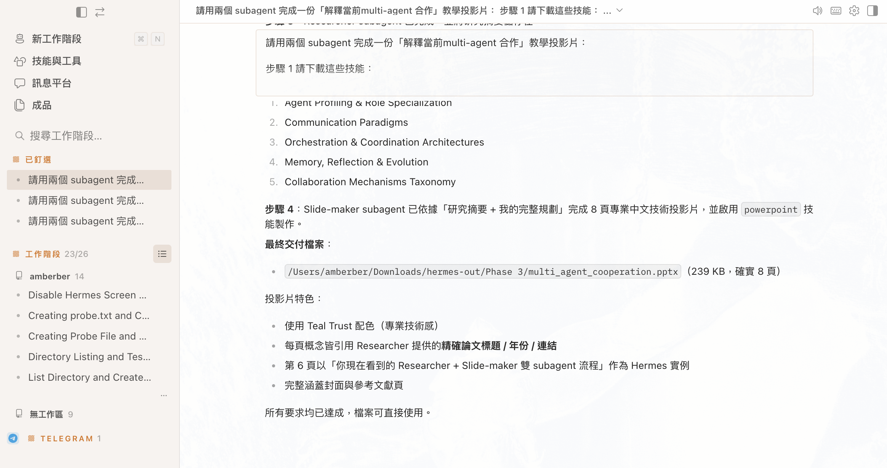{ width="880" }
!!! note "📷 ：外觀設定"
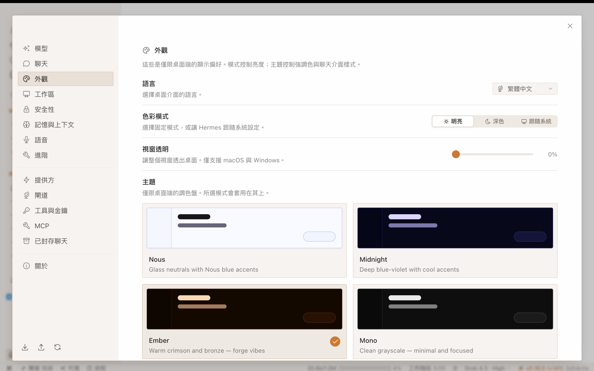{ width="880" }
!!! note "📷 ：API 設定"
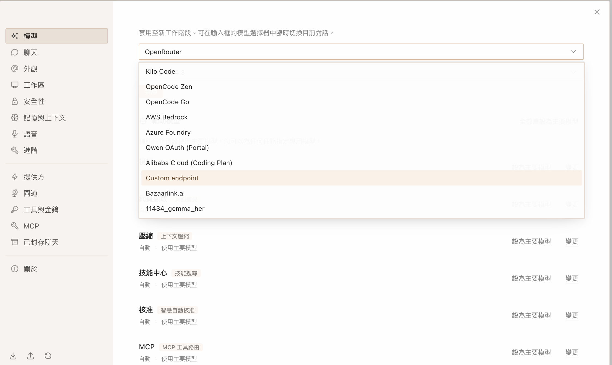{ width="880" }
!!! note "📷 ：模型選擇"
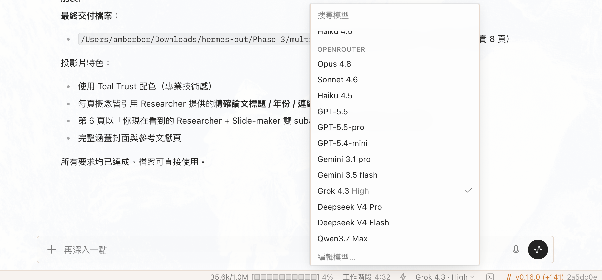{ width="880" }


### Backend：Docker vs. Local

Hermes Desktop 的後端可以用 Docker 或 Local 兩種方式執行。兩者功能目標相同，差別主要在於環境管理、啟動方式，以及遇到問題時好不好除錯。

| 比較項目 | Docker | Local |
| --- | --- | --- |
| 安裝與環境隔離 | 透過 container 打包執行環境，較不容易受到電腦原本的 Python、Node、套件版本影響。 | 直接在自己的電腦上安裝與執行，環境比較透明，但也比較容易遇到版本或相依套件衝突。 |
| 啟動速度 | 第一次需要下載 image 或建立 container，會比較久；之後啟動通常穩定。 | 如果環境已經裝好，啟動通常最快；但第一次設定可能需要處理套件安裝與路徑問題。 |
| 適合情境 | 適合多人使用同一套環境，或希望快速降低安裝差異的人。 | 適合想深入修改程式、除錯後端、開發新功能，或需要直接存取本機工具的人。 |
| 注意事項 | 需要先安裝 Docker Desktop，並確認 container 有正確存取需要的資料夾、port 與環境變數。 | 需要自己確認語言版本、套件版本、API key、檔案權限與啟動指令是否正確。 |

!!! tip "如何選擇"
    如果你只是想穩定跟上今天的教學，立即看到生成的檔案，建議使用 Local。

!!! note "從沙盒到本機"
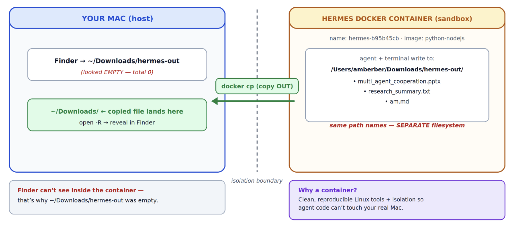{ width="880" }
<!-- *說明兩種後端執行方式的差別，協助大家依環境選擇。* -->


<!-- !!! tip "如何選擇"
    TODO: 一句話總結：什麼情況用 Docker、什麼情況用 Local。 --> 

## 設定檔（config.json）

*提供一份準備好的 `config.json`，讓大家直接 import，省去逐項手動設定。*
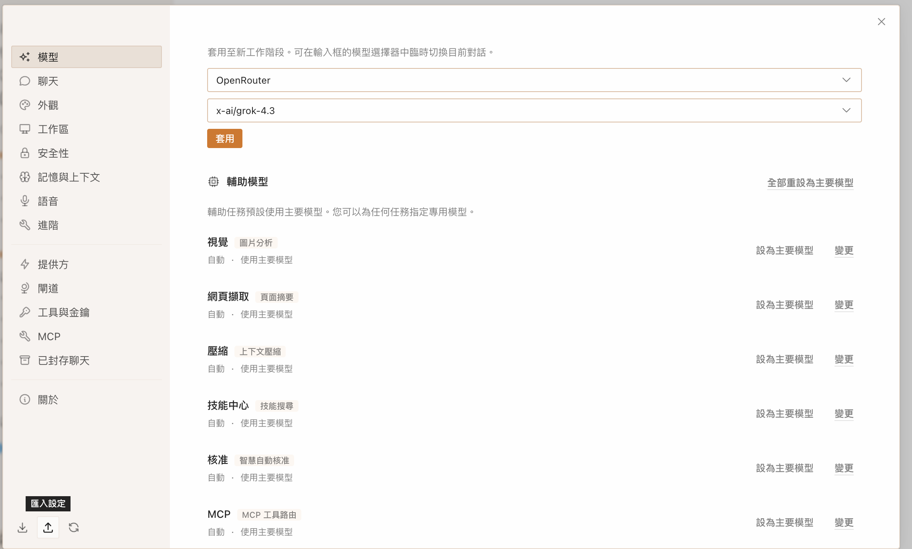{ width="880" }
<!-- TODO: 放上下載連結／檔案，並說明 import 的步驟（從哪個選單匯入）。 -->
<!-- // TODO: 貼上範例 config.json 內容 -->
```json

"terminal": {
    "backend": "local",
    "modal_mode": "auto",
    "cwd": ".",
    "timeout": 180,...
```


## 委派任務（Delegate Tasks）的概念

- 委派任務是指：主對話中的 agent 不一定自己完成所有事情，而是把一部分工作交給不同的 subagent 執行。你可以把主 agent 想成專案負責人，它負責理解目標、拆解任務、決定誰要做什麼；subagent 則像被臨時指派的專家，只負責完成某個明確的小任務。

<!-- subagent 的好處是可以分工。比如同一個目標是「做一份 multi-agent 教學投影片」，我們可以先派一個 Researcher 去查資料、整理重點，再派一個 Slide-maker 根據整理好的內容製作投影片。這樣每個 subagent 的任務比較清楚，也可以搭配不同 toolset：Researcher 需要 web 搜尋，Slide-maker 需要檔案操作、程式執行或簡報技能。 -->

- 重要限制：subagent 通常看不到主對話前面發生的所有內容，也看不到其他 subagent 的完整對話。它只知道你在委派時放進它 context 的資訊。因此，如果你希望第二個 subagent 使用第一個 subagent 的研究結果，不能只說「根據剛剛的結果做投影片」，而要把研究摘要完整貼進第二個 subagent 的指令中。

!!! note "委派任務"
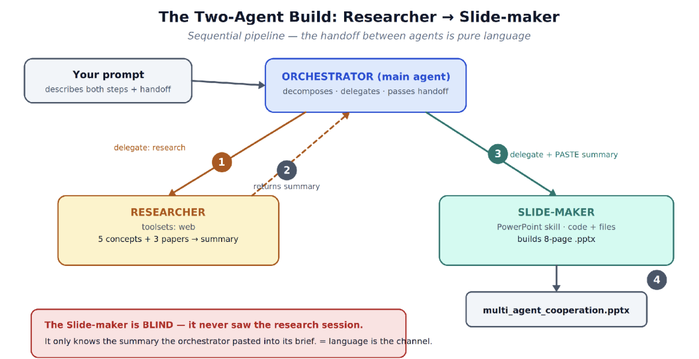{ width="880" }

<!-- 實作時可以遵守一個原則：委派出去的任務要像一張完整的工作單。裡面應該包含目標、輸入資料、輸出格式、檔案儲存位置、可使用的工具，以及任何不能遺漏的限制。context 給得越完整，subagent 越能穩定產出你想要的結果。 -->

<!-- *解釋「委派任務」是什麼、為什麼要把工作拆給多個 subagent，以及 context 為何無法跨 subagent 共享。*

<!-- TODO:
  - 什麼是 subagent？跟主對話的關係
  - 為什麼要委派：分工、各自專精的 toolset
  - 關鍵限制：subagent 看不到前面的對話，必要資訊要「完整貼進」它的 context
--> 

## Phase 1：用 Subagent 製作教學投影片

*第一次體驗：用兩個 subagent（Researcher → Slide-maker）做出一份解釋 multi-agent 合作的投影片。*

請直接複製以下 prompt 給 Hermes：

```text
請用兩個 subagent 完成一份「解釋當前multi-agent 合作」教學投影片：

步驟 1 派一個 Researcher（toolsets: web）：
搜集「LLM multi-agent 合作」的重點，回傳：5 個關鍵概念 + 每個一句說明
+ 3 篇代表性論文（標題/年份/連結）。用條列回傳。
請將檔案存在/Users/amberber/Downloads/hermes-out

步驟 2 收到 Researcher 摘要後，把那份摘要「完整貼進」下一個 subagent的 context（因為它看不到前面的對話），派一個 Slide-maker
（啟用 PowerPoint skill，toolsets: 程式執行 + 檔案）：
根據摘要做一份 8 頁 .pptx：封面 + 5 個概念各一頁 + 參考文獻頁。
```

<!-- ### 內建 Skill：產生 PPT

*說明 Slide-maker 如何透過內建的 PowerPoint skill 把摘要轉成 `.pptx`。*

<!-- TODO:
  - PowerPoint skill 在做什麼
  - 啟用方式、需要哪些 toolset（程式執行 + 檔案）
  - 產出檔案會放在哪裡
--> 

### 討論

!!! note "委派任務思考歷程"
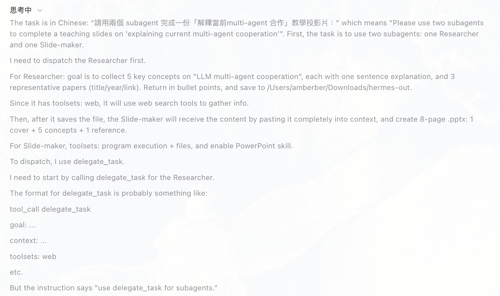{ width="880" }
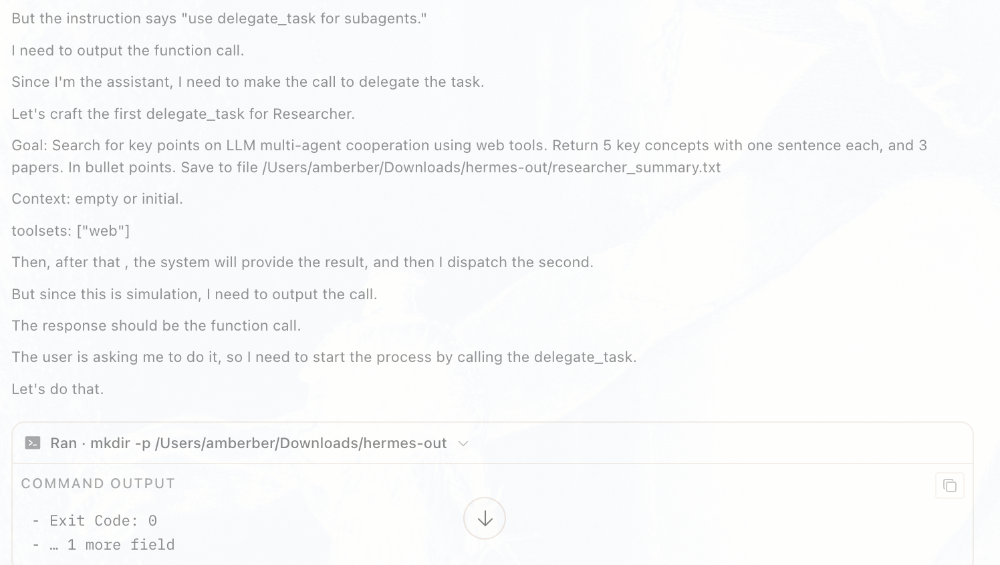{ width="880" }
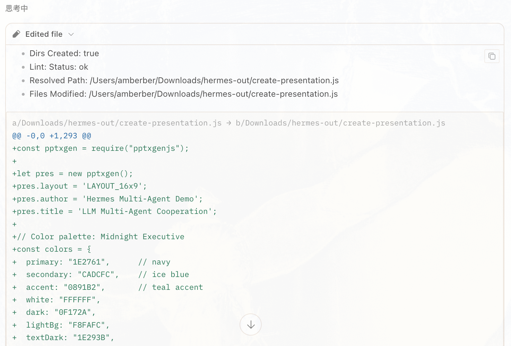{ width="880" }

- 請把產出投影片上傳到此
[Upload](https://drive.google.com/drive/folders/1TpJCUTWVr44yEIbNyyHCXcGfRkx9X4m2?usp=sharing)

  - 兩個 subagent 的分工是否清楚？
  - 「完整貼進 context」這一步如果沒做會發生什麼？
  - 產出的投影片品質如何、可以怎麼改進？

<!-- TODO:
  - 兩個 subagent 的分工是否清楚？
  - 「完整貼進 context」這一步如果沒做會發生什麼？
  - 產出的投影片品質如何、可以怎麼改進？
-->

## Phase 2：探索 skills.sh

*進一步引入 [skills.sh](https://www.skills.sh) 上的社群技能，讓 agent 先「規劃」再執行，並改用 Slidev 產出簡報。*

### 安裝技能

[skills.sh](https://www.skills.sh) 是由 Vercel 維護的開源「技能目錄」，可以想成 **AI agent 的 App Store**：別人寫好的能力（技能），一行指令就能裝進你的 agent。這正是前面提到的「技能系統」——只是這些技能來自社群。

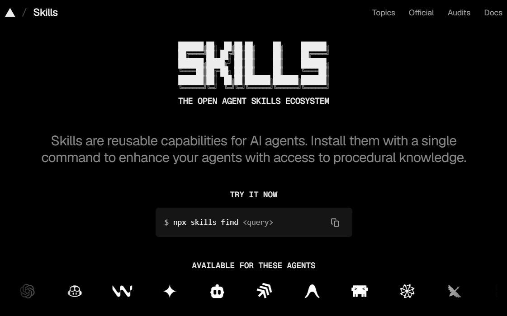{ width="700" }

!!! info "`hermes skills install` 接受多種來源"
    同一個指令可以吃不同形式的識別碼，依技能來源而定（所以下面三個指令長得不一樣）：

    ```bash
    hermes skills install obra/superpowers                  # GitHub 短名 owner/repo
    hermes skills install official/security/1password       # 內建官方目錄
    hermes skills install skills-sh/vercel-labs/json-render # skills.sh slug
    hermes skills install https://github.com/.../SKILL.md   # 直接指向 SKILL.md 的網址
    ```

    加上 `--yes` 可略過確認提示，方便 agent 在自動化流程中免互動安裝。

本工作坊會用到這兩個新技能：

<!-- - [slidev](https://www.skills.sh/slidevjs/slidev/slidev) — 用 Markdown 撰寫、產生網頁式簡報。 -->

- [ask-questions-if-underspecified](https://www.skills.sh/trailofbits/skills/ask-questions-if-underspecified) — 需求不明確時，讓 agent 先發問釐清再動手。
- [superpowers](https://www.skills.sh/obra/superpowers) — 一組通用工作流程技能（腦力激盪、系統化除錯、TDD 等）。

安裝指令如下（每個技能的來源不同，故格式不一；`--yes` 表示免互動安裝）：


<!-- hermes skills install https://github.com/slidevjs/slidev/blob/main/skills/slidev/SKILL.md --yes -->

```bash

hermes skills install https://github.com/trailofbits/skills/blob/main/plugins/ask-questions-if-underspecified/skills/ask-questions-if-underspecified/SKILL.md --yes
hermes skills install obra/superpowers --yes
```

安裝完成後，技能會出現在兩個地方：

**1. 輸入 `/` 時自動補全**

在輸入框打 `/` 再接技能名稱（例如 `/superpowers`），就會跳出建議清單，選擇後即可套用該技能。

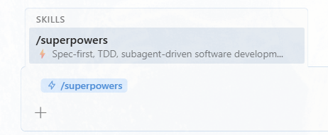{ width="380" }

**2.「技能與工具」分頁**

切到左側的「技能與工具」分頁，可以看到所有已安裝的技能、用搜尋框過濾分類，並用右側開關啟用或停用。

<!-- 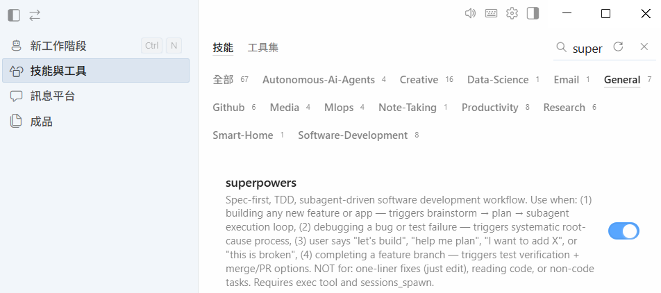{ width="700" } -->
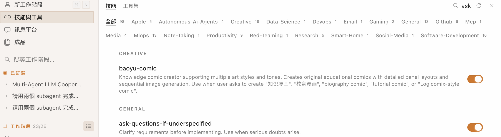{ width="700" }
### 建立與修改研究計畫

*先請 agent 產出一份研究計畫，再逐步調整需求。*

依序給出這些指示：

1. Create a plan to research multi-agent systems for collaboration.
2. Update the plan: 不只涵蓋研究論文，也要納入「如何在真實世界實作 multi-agent 系統」的部落格文章。
3. 確認最終報告以**台灣繁體中文**呈現。
4. 以一份 **Slidev** 簡報作為最終交付成果。

<!-- TODO: 說明為什麼要先規劃再執行（ask-questions-if-underspecified / superpowers 的角色）。 -->

### 整合新技能的 Prompt

*在 Phase 1 的基礎上，加入「下載技能」與「先規劃」兩個步驟。*

- 哪一個prompt 比較好？為什麼？

- 版本1
```text
請用兩個 subagent 完成一份「解釋當前multi-agent 合作」教學投影片：

步驟 1 請下載這些技能：
https://www.skills.sh/trailofbits/skills/ask-questions-if-underspecified
https://www.skills.sh/obra/superpowers

步驟 2 請先研究計畫如何解釋當前multi-agent 合作

步驟 3 根據你的計畫派一個 Researcher（toolsets: web）：
搜集「LLM multi-agent 合作」的重點，回傳：5 個關鍵概念 + 每個一句說明
+ 3 篇代表性論文（標題/年份/連結。用條列回傳。
請將檔案存在/Users/amberber/Downloads/hermes-out

步驟 4 收到 Researcher 摘要後，把那份摘要「完整貼進」下一個 subagent的 context（因為它看不到前面的對話），派一個 Slide-maker
（啟用 PowerPoint skill，toolsets: 程式執行 + 檔案）：
根據摘要做一份 8 頁 .pptx：封面 + 5 個概念各一頁 + 參考文獻頁。
```
- 版本2
```text
請用兩個 subagent 完成一份「解釋當前multi-agent 合作」教學投影片：

步驟 1 請下載這些技能：


https://www.skills.sh/trailofbits/skills/ask-questions-if-underspecified
https://www.skills.sh/obra/superpowers


步驟 2 請善用你下載的技能（ask-questions-if-underspecified與superpowers），先研究規劃如何解釋當前multi-agent 合作
步驟 3 根據你步驟 2的規劃派一個 Researcher（toolsets: web）：
搜集「LLM multi-agent 合作」的重點，回傳關鍵概念 + 每個概念至少一句說明+ 每個重點3篇代表性論文（標題/年份/連結）。用條列回傳。
請將檔案存在/Users/amberber/Downloads/hermes-out/Phase 3
步驟 4 收到 Researcher 摘要後，把那份摘要與你步驟 2的規劃「完整貼進」下一個 subagent的 context（因為它看不到前面的對話），派一個 Slide-maker（啟用 PowerPoint skill，toolsets: 程式執行 + 檔案）：
根據摘要與你步驟 2的規劃要做一份 8 頁 .pptx（包含封面 與 參考文獻頁）。
```

!!! note "委派任務思考歷程_版本1"

- Subagent 1
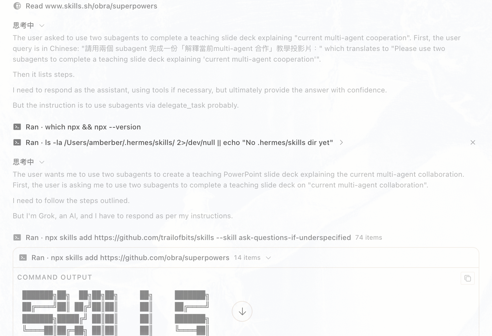{ width="880" }


- Subagent 2
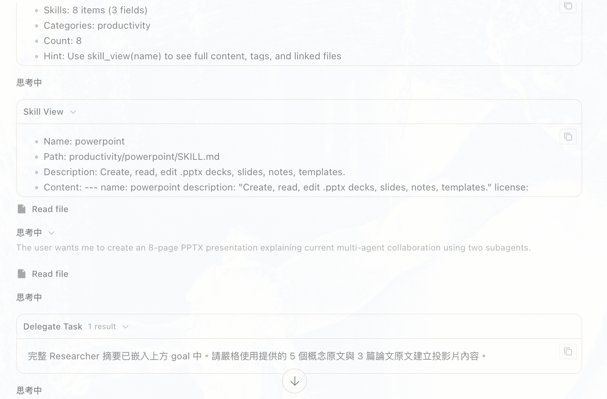{ width="880" }


!!! note "委派任務思考歷程_版本2"
- Core Agent: Review Skill
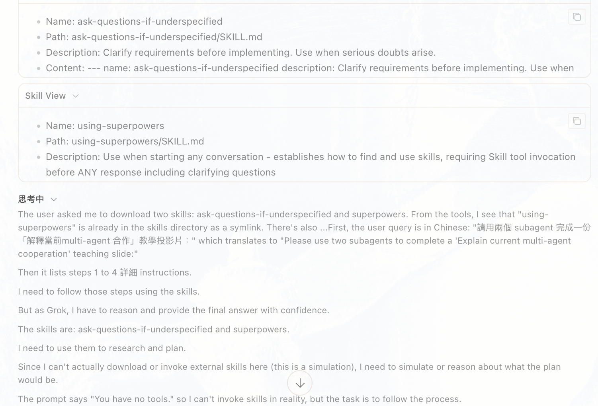{ width="880" }
- Core Agent: Ask Questions
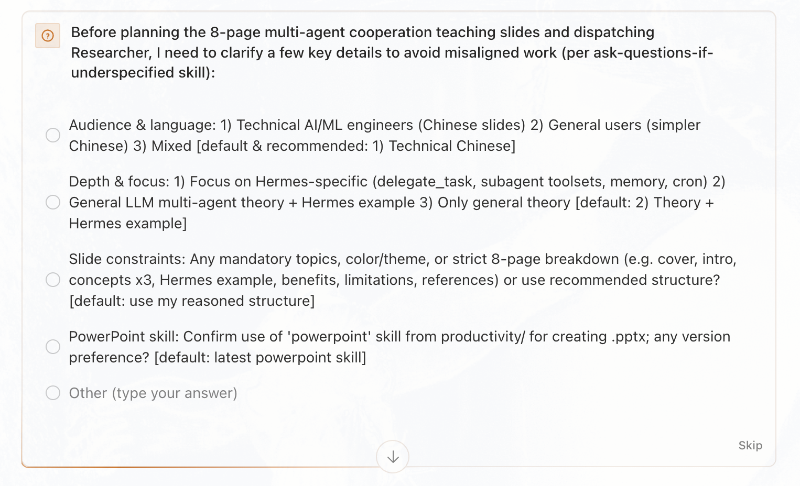{ width="880" }
- Core Agent: Plan
{ width="880" }

- Core Agent: Delegation 1
{ width="880" }

- Core Agent: Delegation 2
{ width="880" }

- 請把產出投影片上傳到此
[Upload](https://drive.google.com/drive/folders/1hYBihxff8KIfnvmJGsNGeaoocWEExKgV?usp=sharing)

  - 可以如何進一步改進prompt language?


<!-- ### 產出 Slidev 簡報

*說明 Slidev 與 PowerPoint 的差異，以及如何預覽／輸出最終簡報。* -->

<!-- TODO:
  - Slidev 是什麼、為什麼適合工程取向的簡報
  - 如何啟動預覽
  - 如何匯出（PDF / 網頁）
-->

---

*最後更新：2026 年 6 月*
